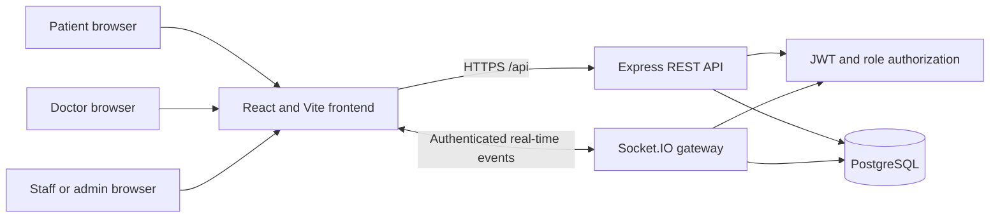
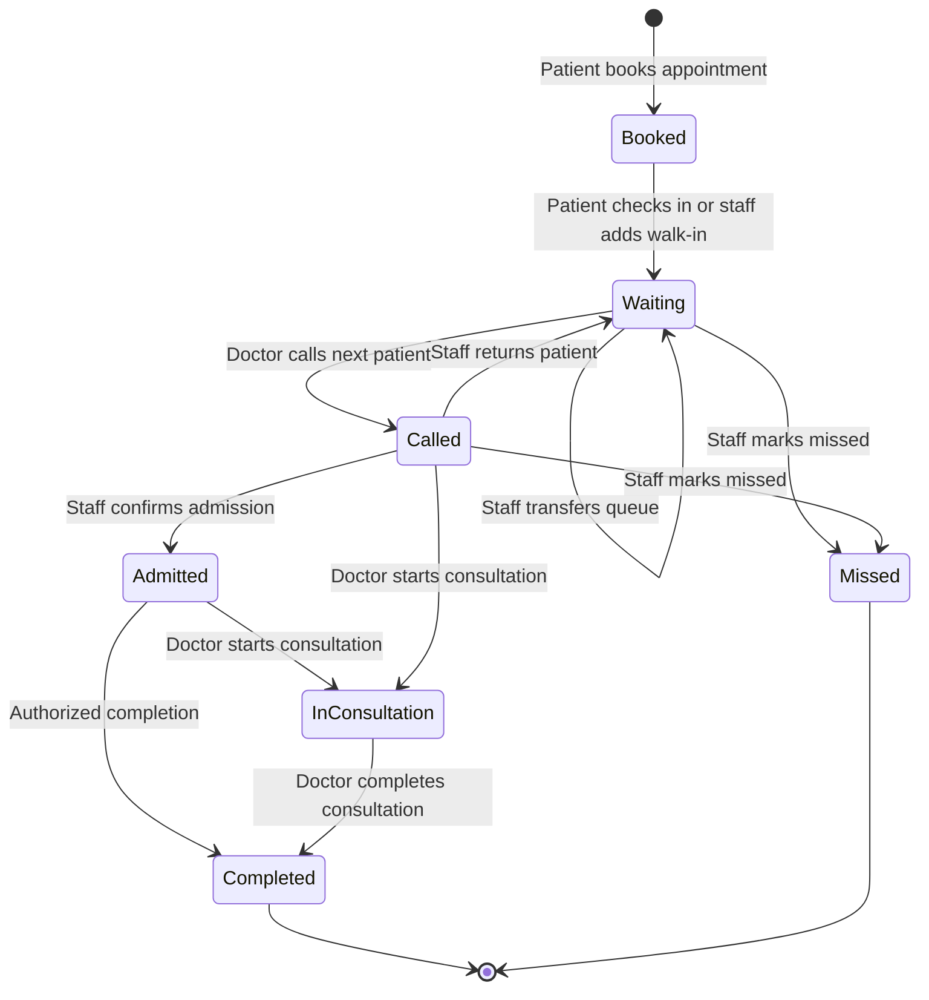
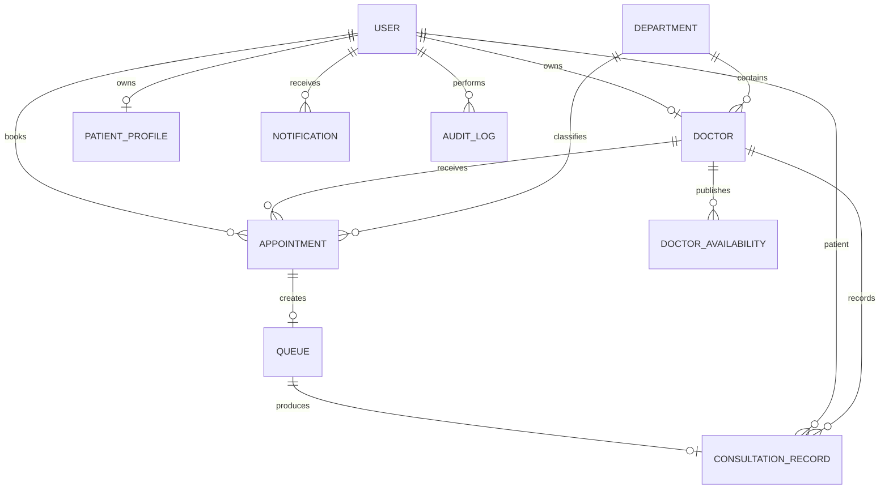

# System Architecture

## Overview

The Smart Clinic Appointment and Patient Queue Management System uses a three-tier web architecture. React provides the browser interface, Express exposes authenticated HTTP and Socket.IO services, and PostgreSQL stores operational and clinical data.

## Roles and responsibilities

| Role | Principal capabilities |
| --- | --- |
| Patient | Maintain profile, find open slots, book appointments, join the queue, view live status, receive notifications, view visit summaries |
| Doctor | Maintain professional details and availability, view assigned queue, call patients, conduct consultations, save structured records |
| Staff | Manage departments and doctor assignments, register walk-ins, monitor queues, admit/transfer/return patients, reschedule appointments |
| Administrator | All staff functions plus responsibility for controlled staff provisioning and operational oversight |

## Core workflow

## Data model

## Security boundaries

- Public registration accepts only patient and pending-doctor roles.
- Every protected HTTP request verifies the JWT and rechecks the current database role/status.
- Socket connections perform the same account validation before joining rooms.
- Staff/admin routes enforce server-side role checks; frontend guards are usability controls only.
- Doctor-to-patient access is limited to queue records assigned to that doctor.
- Notifications are stored per recipient so read state is private to each user.
- Database migrations provide uniqueness constraints for users, active appointment slots, queue records, and daily queue numbers.

## Real-time event model

Authenticated sockets join `user:<id>` and `role:<role>` rooms. Patients additionally join `patient:<user-id>` and doctors join `doctor:<doctor-id>`. Queue changes publish refresh events only to affected doctors, patients, and staff/admin rooms.
