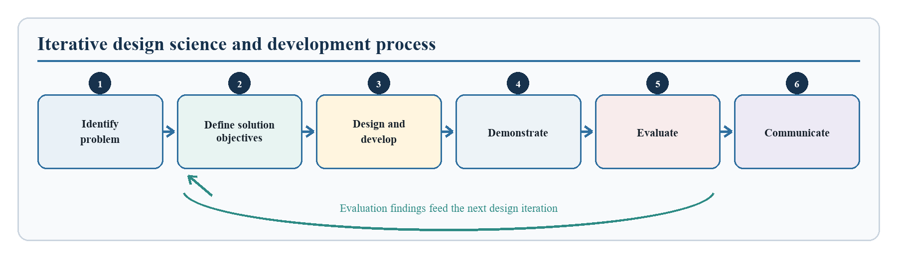
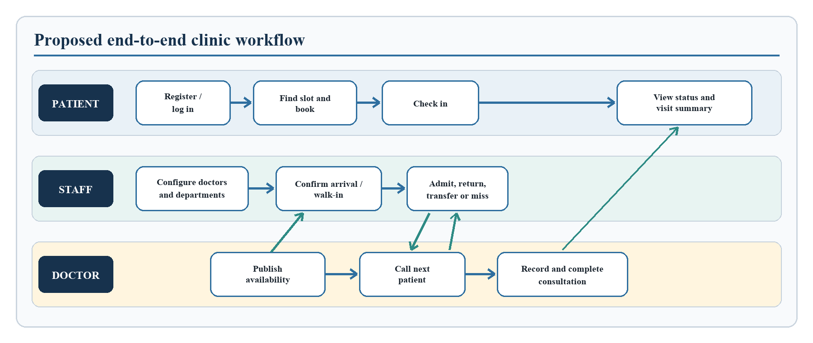
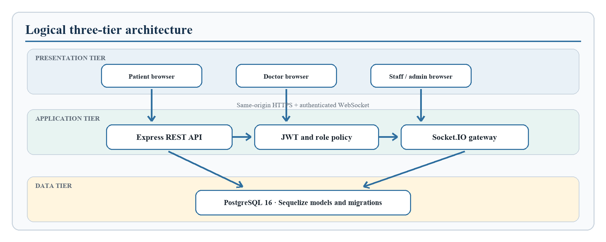
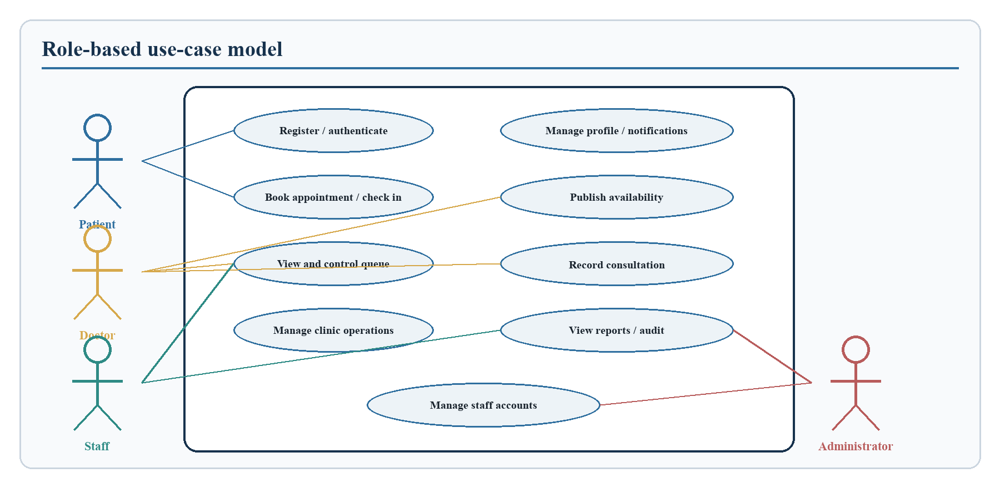
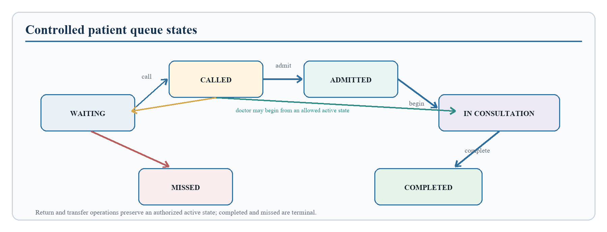
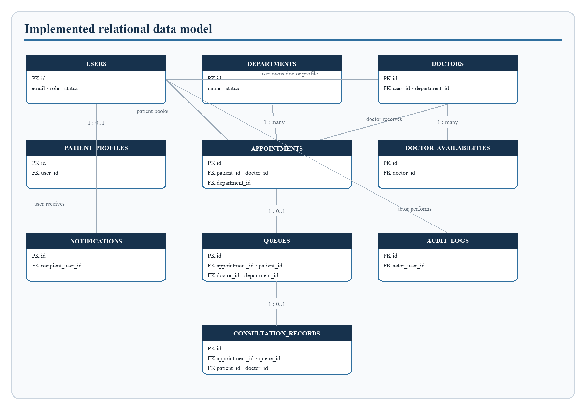
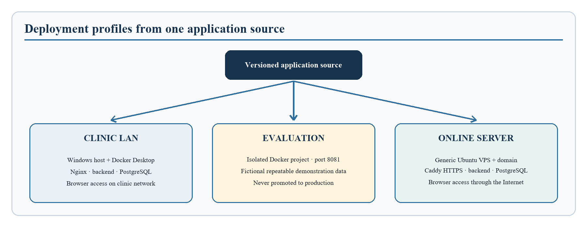

# CHAPTER THREE
## RESEARCH METHODOLOGY AND SYSTEM DESIGN

### 3.0 Introduction

This chapter explains the methodology adopted for the design and implementation of the Smart Clinic Appointment and Patient Queue Management System. It describes how the problem was translated into verifiable system requirements, how the proposed solution was modelled, the architecture and database structures used, the major implementation decisions, and the procedure designed for testing the completed system. The purpose is to provide a reproducible account of the work rather than merely describe the finished interfaces.

The project is an applied information-systems study whose principal output is a working software artefact. Consequently, the methodology combines design science research with iterative software development. Design science is appropriate because it begins with a practical problem, constructs an artefact intended to address that problem, and evaluates the artefact against stated objectives. Peffers et al. (2007) describe this process in terms of problem identification, definition of solution objectives, design and development, demonstration, evaluation, and communication. These activities were adapted to the scale of the present final-year project. The source is retained as an authorised seminal-methodology exception to the normal 2021-to-present reference window.

Requirements were documented as observable behaviours and quality conditions. This follows the general requirements-engineering principle that a requirement should be specific enough to support design and verification (ISO/IEC/IEEE, 2018). The methodology therefore links the objectives stated in Chapter One to implemented modules and test cases. Chapter Three concentrates on how the system was produced and evaluated; the actual measured results and screenshots are reserved for Chapter Four.

### 3.1 Research Design

#### 3.1.1 Design Science Approach

The study adopted a design science research approach. The artefact is a responsive web application that integrates clinic appointment booking, patient arrival, daily queue allocation, clinical workflow, notifications, consultation recording, and operational reporting. The application was not treated as a demonstration screen only. Its backend rules, database constraints, role boundaries, real-time events, deployment configuration, backup procedure, and recovery process formed part of the artefact.

The design science activities were applied as follows. First, the problem was identified as the fragmentation and delay created when appointments and physical queues are managed manually or as separate processes. Second, the solution objectives were stated as online booking, automated queue allocation, real-time status visibility, controlled access, reliable record keeping, and deployability in a small clinic. Third, the system was modelled and implemented in functional increments. Fourth, representative patient, staff, doctor, and administrator workflows were demonstrated against a clean database. Fifth, automated and runtime tests were used to evaluate correctness, security boundaries, concurrency, responsiveness, and recoverability. Finally, the architecture, manuals, evidence records, and project chapters were prepared to communicate the artefact and its evaluation.

This method avoids claiming a clinical experiment that was not performed. No patient treatment outcome was measured and no human-subject satisfaction survey is presented in this chapter. Usability was assessed technically through responsive layouts, guided workflows, clear status labels, error handling, and headless browser checks. A future field study with approved clinic participants could extend the evaluation after institutional and privacy requirements have been satisfied.

Figure 3.1: Iterative design science and development process adopted for the study.

#### 3.1.2 Iterative Development Procedure

Development proceeded in short, revisable increments because appointment and queue rules affect several actors at the same time. A change to patient check-in, for example, also affects staff monitoring, doctor queue order, notification delivery, database status, and reporting. An iterative procedure allowed these related effects to be examined before another function was added.

The first increment established user authentication and the four system roles. The second introduced departments, doctor profiles, assignments, and availability windows. The third connected patient booking to available doctor slots and added controls against duplicate active appointments. The fourth implemented patient arrival and the daily queue state machine. The fifth added doctor consultation records, patient visit history, notifications, operational reports, and audit events. The final increments addressed security hardening, responsive interfaces, deployment packaging, backup and restore, client evaluation data, and evidence-producing verification.

Each increment followed a common cycle: define an expected behaviour, implement the smallest coherent module, run local checks, exercise the related workflow, inspect failures, and revise the design. Regression tests were retained so that later changes could not silently remove earlier controls. This cycle was particularly important for overlapping availability windows, appointment collisions, queue-number allocation, notification isolation, and role authorisation.

#### 3.1.3 Objective-to-Method Alignment

The project objectives governed the design and evaluation procedure. Table 3.1 connects each objective to its research question, the method applied in this chapter, and the evidence boundary that must be respected in Chapters Four and Five. The fourth objective is deliberately reported as partially validated because technical performance and workflow correctness were tested, whereas participant-based user satisfaction was not measured.

Table 3.1: Alignment of project objectives, research questions, methods, and evidence boundaries

| Objective | Matching research question | Chapter Three method and design response | Evidence boundary |
|---|---|---|---|
| O1: Design a digital framework for appointment scheduling and patient queue management | RQ1: How can a digital framework support appointment scheduling and patient queue management in a clinic? | Requirements analysis, role model, three-tier architecture, relational database, and workflow design | Technical design and implementation evidence; no claim of clinical effectiveness |
| O2: Incorporate real-time appointment and queue monitoring | RQ2: How can real-time monitoring provide authorised users with current appointment and queue status? | Authenticated Socket.IO rooms, stored notifications, queue refresh events, and responsive dashboards | Verified event delivery and interface refresh; no claim about real-world waiting-time reduction |
| O3: Implement integrated automated appointment booking and queue management | RQ3: How can the two workflows be integrated while preserving data and process consistency? | Availability validation, collision prevention, arrival, transactional queue allocation, controlled states, consultation, and reporting | Synthetic end-to-end and concurrency evidence only |
| O4: Evaluate efficiency, accuracy, and user satisfaction | RQ4: To what extent does the system satisfy technical efficiency and accuracy criteria, and what participant study is required for user satisfaction? | Layered automated, API, browser, real-time, performance, recovery, and security-boundary testing | Technical evaluation completed; user satisfaction requires a future approved participant study |

### 3.2 Requirements Determination and Analysis

#### 3.2.1 Sources of Requirements

Requirements were derived from the approved project aim and objectives, the problem description in Chapter One, the clinic workflow investigated in the literature review, and analysis of the information that must move between patients, reception staff, doctors, and administrators. Existing project code and supervisor corrections were also reviewed to prevent a mismatch between the written report and the software being defended. The requirements were refined during implementation whenever a workflow exposed an ambiguous state or missing control.

The study used desk-based workflow analysis rather than presenting unsupported claims of interviews or direct observation. The principal workflow was decomposed into registration, provider setup, appointment selection, arrival, queue service, consultation, notification, and reporting. For every activity, the actor, input, processing rule, stored data, output, authorisation condition, and possible failure were identified. The resulting requirements were written in testable form and assigned identifiers for traceability.

#### 3.2.2 System Actors and Responsibilities

Four actors interact with the application. Their responsibilities are separated to reflect clinic duties and to protect information from unnecessary access.

Table 3.2: System actors, responsibilities, and access boundaries

| Actor | Main responsibilities | Access boundary |
|---|---|---|
| Patient | Register, maintain a profile, view open slots, book an appointment, check in, track queue status, receive notifications, and view personal visit summaries | Can access only the patient's own appointments, profile, notifications, queue records, and permitted visit history |
| Doctor | Maintain professional information and availability, view an assigned queue, call patients, begin and complete consultations, and record clinical summaries | Can access patients connected to the doctor's active queue or consultation assignment |
| Staff | Manage departments and doctor assignments, register walk-ins, monitor queues, admit, return, transfer, reschedule, or mark patients missed | Can perform clinic operational functions but cannot create another privileged user unless specifically authorised |
| Administrator | Perform staff functions, provision and manage staff accounts, review operational information, and supervise configuration | Has privileged operational control; the role cannot be selected through public registration |

#### 3.2.3 Functional Requirements

Functional requirements define the services the proposed system must provide. The identifiers in Table 3.3 support later traceability to implementation modules and tests.

Table 3.3: Functional requirements and acceptance indications

| ID | Functional requirement | Acceptance indication |
|---|---|---|
| FR-01 | The system shall register patient accounts and pending doctor accounts through public registration | A valid account and the corresponding patient or doctor profile are created |
| FR-02 | The system shall authenticate a user and direct the user to a role-appropriate dashboard | Valid credentials return a session token; invalid or inactive credentials are rejected |
| FR-03 | An administrator shall create, deactivate, reactivate, and reset staff accounts | The account status immediately affects subsequent authentication and authorisation |
| FR-04 | Staff shall manage departments and assign pending doctors to active departments | The assigned doctor becomes available for scheduling under the selected department |
| FR-05 | A doctor shall define active, non-overlapping weekly availability windows and slot duration | Valid windows are saved; overlapping or invalid windows are rejected |
| FR-06 | A patient shall view only appointment slots that remain available for an active doctor | Occupied, past, inactive, and out-of-window slots are excluded |
| FR-07 | A patient shall book, view, or reschedule an appointment subject to clinic rules | A valid appointment is stored and conflicting active bookings are prevented |
| FR-08 | Staff shall register a walk-in patient where an advance appointment does not exist | A valid appointment and queue entry are created through an authorised workflow |
| FR-09 | The system shall allocate a unique daily queue number for the assigned doctor when an eligible patient arrives | One queue record is created and the number is unique for that doctor and date |
| FR-10 | Authorised users shall move a queue entry only through permitted states | Waiting, called, admitted, in-consultation, completed, and missed transitions remain consistent |
| FR-11 | Staff shall transfer or return an eligible patient without producing duplicate active queue records | Doctor, department, number, status, and transfer information are updated safely |
| FR-12 | The assigned doctor shall record the presenting complaint, findings, diagnosis, treatment plan, advice, and summary | A consultation record is linked to the correct appointment, queue, doctor, and patient |
| FR-13 | Relevant users shall receive stored and real-time notifications when important workflow events occur | Events are delivered only to the intended user and role rooms |
| FR-14 | Staff and administrators shall view operational reports and queue indicators | Reported counts are derived from stored appointment and queue data |
| FR-15 | Material administrative and workflow actions shall create audit records | The action, actor, target, time, and relevant metadata are retained |
| FR-16 | The system shall expose health and readiness information for deployment monitoring | Infrastructure can distinguish a running process from one ready to serve requests |

#### 3.2.4 Non-Functional Requirements

Non-functional requirements specify the qualities and constraints under which the functions operate.

Table 3.4: Non-functional requirements and verification approaches

| Category | Requirement | Verification approach |
|---|---|---|
| Security | Passwords shall be hashed; tokens shall expire; privileged roles shall not be self-assigned; every protected HTTP and real-time request shall be authorised on the server | Authentication, role-escalation, stale-token, inactive-account, ownership, socket, secret, and dependency checks |
| Data integrity | The database shall prevent duplicate email addresses, active doctor slots, queue records, and daily queue numbers | Migration inspection, constraint tests, collision tests, and concurrent-arrival tests |
| Performance | Under a representative load of at least 25 concurrent users, normal API requests should remain below two seconds at the 95th percentile with no unexpected error | Timed concurrent request workload with machine-readable output |
| Responsiveness | Relevant queue and notification changes should become visible within two seconds under the representative test load | Authenticated Socket.IO event and workflow checks |
| Usability | Interfaces shall be understandable and usable at current desktop and phone viewport sizes | Headless browser checks at 1440 by 900 and 390 by 844 pixels, guided-tour review, and error-message inspection |
| Reliability | Restarting application services shall not remove committed operational records | Container restart and record-persistence rehearsal |
| Recoverability | An authorised operator shall be able to back up and restore the PostgreSQL database | Backup generation, isolated restoration, and record-count comparison |
| Maintainability | Presentation, routing, controllers, models, migrations, configuration, and deployment concerns shall remain separated | Source-tree and configuration inspection, lint, syntax, and build checks |
| Portability | The application shall be deployable on a Windows clinic host and a generic Ubuntu server without changing source code | Independent Docker Compose validation and clean-install rehearsals |

### 3.3 Analysis of the Existing and Proposed Systems

#### 3.3.1 Existing Manual Process

The existing problem context assumes a clinic in which appointment requests, arrival order, and communication are handled manually or through disconnected tools. A patient may need to visit or call the clinic to ask whether a doctor is available. Staff may record bookings in a paper register or an informal spreadsheet. On arrival, patients are placed in a visible or verbal queue, while doctors depend on staff to identify the next person. Changes such as absence, transfer, delayed arrival, or rescheduling are communicated individually.

This process lacks a single authoritative state. The appointment record may say that a patient is booked while the reception desk treats the same patient as waiting and the doctor has no current notification. Manual numbering can also produce duplicate or unclear positions when several patients arrive at nearly the same time. The absence of structured timestamps makes it difficult to estimate waiting time or explain how a case moved through the clinic. Furthermore, paper notes and shared messaging channels do not provide the role and ownership controls expected for personal and clinical information.

#### 3.3.2 Weaknesses Identified

The analysis identified six main weaknesses. First, patients cannot reliably discover open slots without staff assistance. Second, the separation of booking from arrival and queue handling creates repeated data entry. Third, queue status is not visible to all authorised participants at the same time. Fourth, manual processes provide weak protection against appointment collisions, duplicate queue numbers, and invalid transitions. Fifth, operational reporting requires a later manual count whose accuracy depends on the original records. Sixth, recovery from loss, damage, or accidental alteration is difficult when records are not held in a managed database with tested backups.

These weaknesses were converted into design objectives rather than being treated as general complaints. For example, the collision problem produced an availability calculation, a database partial unique index, a conflict response, and a concurrent-booking test. The unclear arrival order produced a dated doctor-specific queue number, database uniqueness control, transactional allocation, and concurrency test. The communication problem produced stored notifications and authenticated Socket.IO rooms. This conversion from problem to requirement and verification is central to the research design.

#### 3.3.3 Proposed System Workflow

In the proposed workflow, a patient registers and selects a department, doctor, date, and open time slot. The backend validates the request against doctor assignment, availability, time, and existing active appointments before saving it. On the appointment date, the patient checks in within the allowed period or staff records an authorised arrival or walk-in. The system then creates a queue record and assigns the next daily number for the doctor.

The doctor views an ordered list and calls the next waiting patient. Staff may confirm admission, return a patient to waiting, transfer an eligible patient, or mark a missed case. The assigned doctor begins the consultation, records structured information, and completes the visit. Each important action updates the authoritative database state, creates relevant notifications, and publishes a refresh event to only the affected authenticated users. The patient can later view the permitted visit summary, while staff can examine operational indicators.

Figure 3.2: Proposed patient, staff, and doctor workflow.

#### 3.3.4 Feasibility of the Proposed System

Technical feasibility was established by selecting mature web and database technologies that run on commonly available hardware through containers. A modern browser is sufficient for users; no client-side installation is required on every clinic computer or phone. PostgreSQL supplies transactions, referential integrity, and indexing, while Docker Compose defines repeatable application services. The same application source supports a clinic local-area network and a generic Internet server.

Operational feasibility is supported by role-specific dashboards and by preserving familiar clinic concepts such as departments, appointments, arrival, queue number, call, admission, consultation, completion, and missed status. The workflow can be introduced without requiring patients to understand technical implementation details. Staff retain the ability to register walk-ins and recover from exceptions through return, transfer, reschedule, and missed actions.

Economic feasibility is strengthened by the use of open-source application technologies and the absence of a licence fee for each user device. The clinic still requires suitable hardware, reliable power and networking, backup storage, domain and server costs for Internet deployment, and responsible technical support. Schedule feasibility was addressed through incremental implementation and automated regression checks, which allowed the core workflow to be completed and verified before packaging and documentation.

### 3.4 System Design

#### 3.4.1 Architectural Design

The system uses a three-tier client-server architecture. The presentation tier is a React single-page application built with Vite and styled responsively. It presents role-specific pages, validates basic input for usability, calls the backend through Axios, and receives authenticated real-time events through the Socket.IO client. Client-side route guards improve navigation, but they are not relied upon as a security boundary.

The application tier is a Node.js and Express service. REST controllers implement authentication, administration, departments, doctors, availability, appointments, queues, consultations, patient profiles, notifications, reports, and audit access. Middleware verifies the JSON Web Token, loads the current user from the database, checks account status, and enforces the permitted roles. The same identity checks are applied during the Socket.IO handshake before a connection joins user, role, patient, or doctor rooms.

The data tier is PostgreSQL 16 accessed through Sequelize. Models represent domain entities, while versioned migrations create the schema, foreign keys, enumeration values, indexes, and uniqueness rules. Keeping data rules in the database as well as the application protects critical invariants when requests arrive concurrently. In deployment, a reverse proxy provides the single browser origin, forwards API and WebSocket traffic, and prevents users from needing separate frontend and backend addresses.

Figure 3.3: Logical architecture of the Smart Clinic Appointment and Patient Queue Management System.

#### 3.4.2 Use-Case Design

The use-case design shows which actor initiates each major service. Public registration is limited to patients and pending doctors. Department and doctor assignment are staff functions, while creation and lifecycle management of staff accounts are administrator functions. Queue handling is deliberately shared: patients may check themselves in when eligible, staff handle operational exceptions, and doctors control call and consultation actions. All actors authenticate before accessing protected services.

Figure 3.4: Principal actors and use cases of the proposed system.

#### 3.4.3 Queue-State Design

The queue was designed as a controlled state machine rather than a freely editable text field. A newly checked-in patient enters the waiting state. A doctor may call the patient, after which staff may admit the patient or return the entry to waiting when appropriate. The assigned doctor can begin a consultation from an allowed active state. Completion records the end of service, while a missed state records a patient who did not respond or attend. Transfer changes the assigned doctor or department and safely returns the patient to an appropriate active state with a new daily queue position.

This design prevents actions that would make the record internally inconsistent. A completed queue cannot be called again, an unassigned doctor cannot open an unrelated patient, and one appointment cannot produce multiple queue rows. Timestamps including joined, called, admitted, consultation-started, and completed times support operational measurement without requiring later reconstruction.

Figure 3.5: Permitted queue states and principal transitions.

#### 3.4.4 Major System Modules

The major modules, their principal operations, and their outputs are summarised in Table 3.5.

Table 3.5: Major system modules, operations, and outputs

| Module | Principal operations | Main output |
|---|---|---|
| Authentication and account control | Registration, login, token verification, status and role validation, administrator staff management | Authenticated identity and controlled account lifecycle |
| Department and doctor management | Department maintenance, pending-doctor review, assignment, activation, and professional profile | Active service structure and assigned providers |
| Availability and appointment | Weekly windows, slot generation, booking, viewing, expiry, and rescheduling | Valid appointment linked to patient, doctor, and department |
| Queue management | Check-in, walk-in, number allocation, call, recall, admit, return, transfer, miss, and completion | Ordered daily queue with timestamps and state |
| Consultation and patient history | Authorised profile access, structured notes, completion, and visit summary | Consultation record and permitted longitudinal history |
| Notification and real-time update | Per-user notification storage, read status, room membership, and refresh events | Timely private alerts and synchronized dashboards |
| Reporting and audit | Operational counts, queue metrics, action logging, and review | Traceable management information |
| Deployment and recovery | Environment validation, migration, health checks, persistent storage, backup, restore, and update | Repeatable clinic-LAN and online-server operation |

#### 3.4.5 Interface Design

The interface design follows the division of responsibilities established in the actor model. After authentication, each role is presented with the functions and status information needed for its work. Patient pages prioritise booking, upcoming appointments, queue position, notifications, and visit summaries. Doctor pages prioritise availability, the assigned queue, patient context, and consultation recording. Staff and administrator pages prioritise departments, provider assignment, arrivals, queue exceptions, operational reports, and authorised account management.

Consistent navigation, visible state labels, confirmation feedback, validation messages, loading indicators, and empty-state explanations were used to reduce ambiguity. Responsive layouts support both desktop and phone viewports. Interface controls are usability mechanisms only; the backend repeats authentication, role, ownership, and workflow checks so that hiding or displaying a control does not determine access to protected data.

### 3.5 Database Design

#### 3.5.1 Relational Data Model

The database contains ten principal tables: users, departments, doctors, doctor_availabilities, patient_profiles, appointments, queues, consultation_records, notifications, and audit_logs. A user may own one doctor record or one patient profile according to role. A department has many doctors and appointments. A doctor publishes many availability windows and receives many appointments. An appointment links a patient to a doctor and department and can create at most one queue record. A queue can produce at most one consultation record. Notifications belong to individual recipients, while audit logs associate material actions with an actor where available.

The design is normalized so that account identity, professional assignment, patient profile, scheduling, service order, clinical summary, and operational evidence are stored separately. This reduces duplication and allows rules to be enforced at the correct boundary. Foreign keys specify what happens when referenced data changes or is removed. Restrictive deletion is used where historical relationships must not be silently broken, while dependent profiles or notifications may be removed with their owning account in controlled circumstances.

Figure 3.6: Entity-relationship diagram of the implemented database.

#### 3.5.2 Data Dictionary

The main fields and integrity purpose of each implemented table are identified in Table 3.6.

Table 3.6: Data dictionary for the principal database tables

| Table | Key fields | Purpose and integrity rule |
|---|---|---|
| users | id, email, password, role, status | Stores identity and access state; email is unique and role/status use controlled values |
| departments | id, name, status | Stores clinic service units; department name is unique |
| doctors | id, user_id, department_id, specialization, status | Extends a user as a doctor; user_id is unique and department_id is a foreign key |
| doctor_availabilities | id, doctor_id, day_of_week, start_time, end_time, slot_minutes | Stores weekly service windows; identical windows for one doctor are unique and overlapping windows are rejected by application validation |
| patient_profiles | id, user_id, blood_group, date_of_birth, allergies, chronic_conditions | Extends a user as a patient; one profile is permitted per user |
| appointments | id, patient_id, doctor_id, department_id, appointment_date, appointment_time, status, walk_in | Represents a scheduled or walk-in visit; a partial unique index prevents simultaneous active use of one doctor slot |
| queues | id, appointment_id, patient_id, doctor_id, department_id, queue_number, queue_date, status, timestamps | Represents service order; one row is permitted per appointment and doctor/date/number is unique |
| consultation_records | id, appointment_id, queue_id, patient_id, doctor_id, clinical fields | Stores a structured visit record; queue_id is unique so one queue visit produces at most one record |
| notifications | id, recipient_user_id, type, title, message, payload, read_at | Stores a private copy for the intended recipient and independent read state |
| audit_logs | id, actor_user_id, action_type, target_type, target_id, metadata | Records material actions for accountability and later review |

#### 3.5.3 Integrity and Concurrency Controls

Several controls protect the database beyond ordinary field validation. Unique constraints cover email addresses, department names, one profile per account, one doctor record per account, one queue row per appointment, and one consultation per queue. A partial unique index on doctor, appointment date, and time applies only to active appointment states, thereby allowing historical completed or missed records without permitting two current patients to occupy the same slot.

Daily queue numbers are unique for each doctor and queue date. Number allocation is performed inside a database transaction and coordinated before the next number is committed. The uniqueness constraint remains the final safeguard if simultaneous requests reach the allocation logic. This layered approach is more reliable than calculating a number only in the browser or trusting a previously displayed queue length.

Enumeration fields constrain roles, account status, appointment status, and queue status to known values. Foreign keys maintain relationships among users, departments, doctors, appointments, queues, and consultations. Versioned migrations create these rules consistently in a clean environment, making the database design reproducible across development, clinic-LAN, evaluation, and online-server installations.

### 3.6 System Implementation

#### 3.6.1 Development Technologies

Only technologies present in the implemented and packaged application are listed in Table 3.7.

Table 3.7: Implemented development and deployment technologies

| Layer or concern | Technology | Reason for selection |
|---|---|---|
| User interface | React 19, React Router, Tailwind CSS, Lucide icons | Component reuse, role-specific navigation, responsive layout, and clear interface feedback |
| Build tooling | Vite 8 and ESLint 9 | Fast development workflow, optimized production build, and static quality checking |
| HTTP client | Axios | Consistent API requests, headers, and error handling |
| Application server | Node.js and Express 4 | Suitable JavaScript service layer with clear routing and middleware support |
| Real-time communication | Socket.IO 4 | Authenticated bidirectional events, room isolation, and reconnection support |
| Authentication | JSON Web Token and bcryptjs | Expiring signed sessions and one-way password hashing |
| Data access | Sequelize 6 and PostgreSQL driver | Model-based data access, transactions, migrations, and PostgreSQL integration |
| Database | PostgreSQL 16 | Relational integrity, indexing, transactions, JSON metadata, and reliable backup tools |
| Packaging | Docker and Docker Compose | Repeatable multi-service builds, isolated configuration, health checks, restart policy, and persistent volumes |
| Reverse proxy | Nginx for clinic LAN; Caddy for online deployment | Same-origin routing and WebSocket forwarding; Caddy additionally manages automatic HTTPS |

#### 3.6.2 Frontend Implementation

The frontend is organized around reusable components, pages, route definitions, and a shared authentication context. After login, the current role determines the available dashboard and navigation options. Patient screens emphasize upcoming appointments, open slots, queue position, notifications, and visit history. Doctor screens emphasize availability, assigned queue entries, patient context, and consultation actions. Staff and administrator screens emphasize departments, providers, appointments, queue exceptions, reports, and account operations.

The interface consumes a same-origin path in packaged deployments. Consequently, a browser on the clinic network does not require a manually configured backend address, and online deployment does not require source changes when the domain changes. Responsive rules permit the same application to be used on desktop and phone viewports. Loading, empty, success, and error states provide feedback so a user can distinguish an unavailable result from a request still in progress.

#### 3.6.3 Backend and API Implementation

The backend separates route declarations from controllers and data models. Routes define the HTTP resource and attach authentication and role middleware. Controllers validate input, enforce workflow conditions, perform database operations, create audit or notification records where required, and return a consistent HTTP response. Central error handling prevents internal stack details from being exposed as ordinary client messages.

At startup, the service validates essential environment variables, including the database connection, allowed frontend origin, and token secret strength. Health and readiness endpoints support container monitoring. Graceful shutdown stops accepting work and closes resources when the service receives a termination signal. These controls are necessary because delivery readiness includes predictable operation, not only successful development-mode execution.

#### 3.6.4 Real-Time Communication

Socket.IO is used to reduce the need for repeated page refreshes during active clinic work. A socket connection supplies a token during its handshake. The server verifies the signature, loads the current account, confirms that the account is active, and determines the current database role before assigning rooms. General rooms follow the forms user:identifier and role:role-name. Patients and doctors additionally join rooms related to their own domain identity.

When an appointment or queue operation succeeds, the backend publishes a refresh event only to affected rooms. A patient therefore receives an update about the patient's own queue, a doctor receives updates for the assigned queue, and staff or administrators receive operational refreshes. The database remains authoritative; an event tells the client to obtain current permitted data rather than becoming an unverified replacement for stored state.

#### 3.6.5 Queue-Number Allocation Algorithm

The allocation procedure begins only after the server has authenticated the actor and confirmed that the appointment is eligible for arrival. The procedure can be summarized in the following steps:

1. Begin a database transaction and identify the appointment, assigned doctor, department, and effective queue date.
2. Check whether the appointment already has a queue record; if it does, return the existing record or reject the duplicate action as appropriate.
3. Coordinate allocation for the doctor and date, then obtain the greatest committed queue number within that scope.
4. Set the candidate number to one when no prior entry exists; otherwise add one to the greatest number.
5. Insert the queue record with waiting status, joined time, and the appointment, patient, doctor, and department identifiers.
6. Update the related appointment to the appropriate arrived state, create notifications and audit evidence, and commit the transaction.
7. If any required operation fails, roll back the transaction so that a partial arrival cannot remain.

After commitment, real-time refresh events are delivered to the affected patient, doctor, and operational roles. The combination of transactional allocation and the unique doctor/date/number index was selected because two arrival requests may be processed almost simultaneously. A purely sequential assumption would not be safe in a web application.

#### 3.6.6 Security and Privacy Design

Security controls were selected around the application's trust boundaries and informed by the verification categories promoted by the OWASP Application Security Verification Standard (OWASP Foundation, 2021). Passwords are hashed with bcrypt before storage. Login produces an expiring JSON Web Token, but possession of a token is not sufficient by itself: every protected request rechecks the current account role and active status in the database. This rejects a deactivated user and prevents a stale role claim from continuing to grant access.

Public registration accepts an explicit allowlist of patient and pending-doctor roles. A submitted staff or administrator role is rejected rather than silently trusted. Privileged staff lifecycle operations require an administrator. Server-side ownership checks restrict appointments, notifications, patient profiles, queue records, and consultations. Doctor access is connected to an assigned active queue or consultation workflow rather than to the visibility of a button in the interface.

The deployment configuration uses environment variables for secrets and database credentials, an explicit Cross-Origin Resource Sharing allowlist, same-origin proxying, health checks, and persistent database storage. Production guidance requires HTTPS, generated secrets, restricted database privileges, protected backups, retention rules, and monitoring that excludes tokens, passwords, and clinical notes. Dependency audits are included in the release procedure. These controls reduce risk but do not replace clinic governance or applicable Nigerian health-data and privacy obligations.

#### 3.6.7 Deployment Design

Two production delivery profiles were prepared from the same source. The clinic-LAN profile assumes one Windows clinic computer running Docker Desktop. PostgreSQL, the backend, and the web proxy run as containers, while authorised computers and phones reach the application through the host's local network address. A persistent Docker volume protects database files across ordinary container replacement. Plain-language scripts support installation, start, stop, status, backup, restore, and update.

The online profile assumes a generic Ubuntu virtual private server, a domain name, and inbound HTTP and HTTPS access. Docker Compose runs the frontend, backend, PostgreSQL, migrations, storage, health checks, and restart policies. Caddy obtains and renews HTTPS certificates and forwards ordinary API and WebSocket traffic. Source code does not depend on a particular hosting provider.

An isolated evaluation profile was also created for demonstration. It uses a separate Compose project, port, and database volume and can generate repeatable fictional accounts and workflow data. Demonstration reset commands operate only when demo mode is enabled and must never be used as a production database. This separation allows a client or examiner to explore all roles without contaminating a live installation.

Figure 3.7: Clinic-LAN, evaluation, and online-server deployment profiles.

### 3.7 System Testing and Evaluation Procedure

#### 3.7.1 Test Environment and Evidence Strategy

Testing was designed to progress from inexpensive static checks to complete runtime workflows. Automated checks were executed in the project workspace, while deployment acceptance used Docker containers and a clean PostgreSQL database. Browser workflows were performed with Microsoft Edge in headless mode so the test did not control or interrupt the visible desktop. Desktop and phone viewports were included. Runtime evidence was written to a timestamped directory rather than copied manually into an untraceable summary.

The evidence bundle was designed to contain machine-readable results, human-readable logs, a requirements-to-test traceability matrix, screenshots, defect status, performance measurements, database and recovery evidence, and an acceptance checklist. A failed or blocked result remains visible and is not rewritten as a pass. This rule helps distinguish a test that was not executed from one that produced the expected result.

#### 3.7.2 Levels of Testing

The layered test design used to move from static checks to complete workflow and recovery verification is presented in Table 3.8.

Table 3.8: Test levels, scope, and retained evidence

| Test level | Scope | Examples of evidence |
|---|---|---|
| Static quality | Source syntax, frontend lint, production build, configuration validity, release contents | Command logs and build output |
| Unit and policy testing | Isolated validation, calculations, middleware, authorisation policy, and migration contracts | Node test runner results |
| Database lifecycle | Clean migration, seeding, constraints, indexes, restart persistence, backup, and restore | Migration logs, schema checks, database counts, and restore logs |
| API integration | Valid, invalid, unauthorised, inactive-user, cross-user, missing-data, and conflict requests | Status codes and workflow log |
| End-to-end workflow | Registration, login, booking, arrival, queue handling, consultation, history, report, and logout | Headless browser and API workflow evidence |
| Real-time testing | Unauthenticated rejection, authenticated connection, room isolation, delivery, and refresh | Socket event log |
| Concurrency testing | Simultaneous booking or arrival and competing queue actions | Unique-result and duplicate-count record |
| Security testing | Role escalation, token failure, account status, ownership, CORS, secrets, logs, and dependency exposure | Policy tests, audit logs, and advisory assessment |
| Performance testing | Representative concurrent requests and response-time percentiles | Machine-readable request count, failures, median, p95, and maximum time |
| Compatibility and recovery | Desktop and phone layouts, service restart, persistent data, backup, restore, and update rehearsal | Screenshots, console/network check, and recovery comparison |

#### 3.7.3 Functional Test-Case Design

Test cases were derived directly from functional requirements and from failure modes that could damage appointment or queue consistency. Authentication cases include successful registration and login, public privileged-role rejection, invalid token, inactive account, and administrator-only account management. Availability cases include valid windows, invalid time order, and overlap without deletion of an existing schedule. Appointment cases include open-slot booking, occupied-slot conflict, unauthorised cross-patient access, and rescheduling.

Queue cases include eligible arrival, daily numbering beginning from one, duplicate check-in, simultaneous arrivals, call and recall, admission, return, transfer, missed status, consultation start, and completion. Clinical cases include assigned-doctor access, unrelated-doctor denial, structured record persistence, and patient visit-summary access. Notification cases verify that one recipient's read action does not mark another recipient's copy as read. Reporting cases compare returned counts with the underlying appointment categories.

Each case records an identifier, requirement reference, precondition, input or action, expected result, actual result, status, environment, date, and evidence reference. Positive cases show that required work can be completed. Negative cases are equally important because they show that forbidden actions and inconsistent states are rejected.

#### 3.7.4 Performance, Concurrency, and Real-Time Procedure

The representative performance workload uses at least 25 concurrent virtual users and 100 normal authenticated requests. Request duration is measured at the client, and failures, minimum, median, 95th percentile, and maximum are recorded. The acceptance gate requires no unexpected error and a 95th-percentile response below two seconds. This is an engineering acceptance threshold for the tested environment, not a claim about every possible clinic network or Internet server.

Concurrency testing sends competing operations close enough together to expose unsafe read-then-write assumptions. Appointment collision testing expects only one active booking for one doctor's date and time. Queue allocation testing expects simultaneous eligible arrivals to receive different daily numbers. Duplicate check-in and competing state actions must not create multiple queue records or contradictory final states. Database constraints and transaction behaviour are inspected together with API results.

Real-time testing first attempts a connection without valid authorisation and expects rejection. An authenticated client then joins only its permitted rooms. A workflow action is performed and the intended client must receive the event within the accepted interval. Reconnection is followed by a fresh data request because current database state, rather than an event previously missed during disconnection, is authoritative.

#### 3.7.5 Security and Recovery Procedure

Security testing covers both ordinary misuse and boundary failures. Requests are made with missing, malformed, expired, and otherwise invalid tokens. Public registration is submitted with privileged roles. Accounts are deactivated after a token has been issued to confirm that the database status check rejects the old session. Separate patient and doctor accounts attempt cross-user access. Socket connections repeat the identity and role checks. Configuration and release archives are inspected for example secrets, generated credentials, databases, backups, temporary evidence, and development-only routes.

Production dependencies are audited separately for the frontend and backend. No high or critical finding is acceptable. A moderate finding must either be removed or documented with a reachability and mitigation assessment. For recovery, a database backup is generated, restored into an isolated target, and compared using relevant record counts. Application containers are restarted and the same committed records are requested again. These checks demonstrate that recovery instructions are executable rather than merely described.

### 3.8 Data Provenance, Privacy, Ethics, Accessibility, and Validation Boundaries

#### 3.8.1 Operational Data Provenance

The project does not use a research dataset and does not train a predictive model. Its data are transactional records created through the application, including accounts, departments, availability windows, appointments, queue events, consultation summaries, notifications, and audit events. Development and evaluation used fictional seeded identities and synthetic workflow records. Clean-install verification created fresh test records through the same API and database rules used by the application. No real patient dataset, copied clinic register, or scraped health information formed part of the evidence baseline.

This provenance distinction matters because system performance measurements describe the behaviour of the implemented software in the tested environment; they do not describe a patient population. Demonstration data support repeatable exploration of each role but cannot establish user satisfaction, clinical benefit, or organisational effectiveness.

#### 3.8.2 Privacy, Ethics, and Governance

The application handles identity, appointment, and potentially sensitive clinical-summary data. Test and evaluation activities therefore use fictional accounts and demonstration records rather than real patient information. Generated passwords, environment files, databases, and backups are excluded from distributable archives. Access is limited by role and ownership, and operational logs should not contain passwords, tokens, or full clinical notes.

A real deployment would require clinic approval, staff training, a privacy and retention policy, secure infrastructure, backup ownership, incident procedures, and review of applicable Nigerian legal and professional obligations. Future user-acceptance research should obtain appropriate consent and approval before involving patients or staff.

#### 3.8.3 Accessibility and Validation Boundary

The interface was designed with readable text, labelled controls, role-specific navigation, meaningful status wording, validation feedback, and layouts that adapt to desktop and phone viewports. Document figures include alternative descriptions, and table headers are identified structurally. These measures improve access and comprehension, but they do not constitute a formal accessibility conformance certification or a participant study involving users with disabilities.

The study evaluates a software artefact and does not claim medical efficacy, diagnosis quality, patient satisfaction, reduced clinical waiting time, public-server penetration resistance, or population-level effectiveness. Technical response time is not the same as patient waiting time. Chapter Four may report only the tests that were actually performed, and Chapter Five must preserve these limitations when drawing conclusions.

### 3.9 Chapter Summary

This chapter explained the design science and iterative development method used for the system. It aligned the objectives with the research questions and evidence boundaries, defined the requirements, analysed the existing and proposed workflows, and documented the architecture, interfaces, database, security controls, operational data provenance, queue algorithm, integration, deployment, and testing procedure. The next chapter presents the implemented interfaces and the actual results obtained against these requirements.
